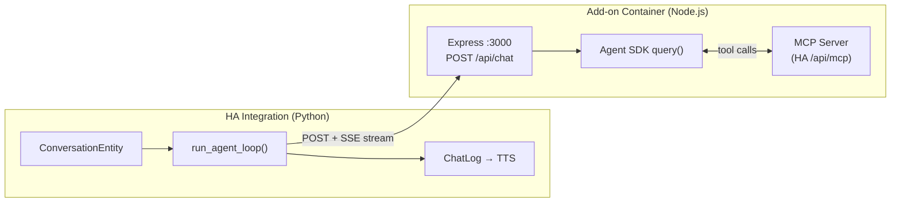

# CLAUDE.md

This file provides guidance to Claude Code (claude.ai/code) when working with code in this repository.

## Project Overview

Home Assistant custom integration that uses Anthropic's Claude as a conversation agent. The system is split into two components:

1. **Node.js Add-on** (`claude-agent/`) -- runs in an HA add-on container, wraps the Claude Agent SDK, handles MCP connections, tool calling, and streaming. Exposes an HTTP+SSE API.
2. **Python Integration** (`custom_components/claude_conversation_agent/`) -- thin HA conversation plumbing that sends user text to the add-on and pipes streaming deltas to TTS.

Claude controls smart home devices exclusively through MCP servers -- it never uses HA's native intent system. The add-on auto-connects to HA's built-in MCP server using SUPERVISOR_TOKEN.

## Commands

### Run tests
```bash
pytest tests/
```

### Run a single test file
```bash
pytest tests/test_agent.py
```

### Run a single test
```bash
pytest tests/test_agent.py::TestRunAgentLoopSimpleText::test_yields_role_then_content -v
```

There is no build step, linter config, or type checker configured. The integration is pure Python loaded by Home Assistant at runtime. The add-on is a Node.js Express server.

## Architecture

### Two-Component Design



### SSE Protocol (Integration ↔ Add-on)

**Request**: `POST /api/chat` with JSON body containing `system_prompt`, `user_text`, `model`, `session_id`, `auth_mode`, `api_key`.

**Response**: SSE stream with event types:
- `init` -- session ID and MCP server status
- `role` -- start of assistant message
- `delta` -- text content chunk
- `result` -- final status with session ID

### Key Modules

#### Add-on (`claude-agent/src/`)

- **`server.js`** -- Express HTTP server. Endpoints: `POST /api/chat` (SSE stream), `GET /api/health`, `GET /api/auth/status`, `POST /api/auth/login`. Serves ingress UI.
- **`agent.js`** -- Wraps `@anthropic-ai/claude-agent-sdk` `query()`. Auto-adds HA MCP server via SUPERVISOR_TOKEN. Disallows all built-in Claude Code tools (Bash, Read, Write, etc.) -- only MCP tools allowed.
- **`auth.js`** -- Dual auth: API key (per-request from integration) and Max subscription (CLI auth persisted in `/data/.claude/`).
- **`ui/index.html`** -- Ingress web UI showing auth status and Max login button.

#### Integration (`custom_components/claude_conversation_agent/`)

- **`agent.py`** -- `run_agent_loop()` async generator that POSTs to add-on `/api/chat`, reads SSE stream, yields `{"role": "assistant"}` and `{"content": "..."}` dicts. `ConversationStateManager` handles per-session state with TTL-based expiry.
- **`conversation.py`** -- `ClaudeConversationEntity` wires HA's conversation interface to the agent loop. Pipes deltas into `ChatLog.async_add_delta_content_stream()`.
- **`config_flow.py`** -- Config flow: hassio discovery or manual URL → auth mode (API key or Max) → conversation subentries.
- **`__init__.py`** -- Entry setup, health-checks the add-on, stores URL as `runtime_data`. Uses Python 3.12+ `type` statement syntax.
- **`const.py`** -- All config keys, defaults, and limits.

### Key Patterns

- **Add-on delegation**: All heavy lifting (Agent SDK, MCP, tool calling) runs in the Node.js add-on container. The Python integration is a thin HTTP+SSE client.
- **Auto MCP**: The add-on auto-connects to HA's MCP server using `SUPERVISOR_TOKEN` from the HA Supervisor environment.
- **Dual auth**: API key mode passes the key per-request. Max subscription mode uses CLI credentials persisted in the add-on container.
- **Security**: Built-in Claude Code tools (Bash, Read, Write, etc.) are explicitly disallowed. Only MCP tools are permitted.
- **Config subentries**: One parent ConfigEntry (add-on URL + auth mode) with multiple conversation subentries (each an independent agent with its own prompt and model).

## Testing

Tests mock all Home Assistant modules via `conftest.py` stubs installed into `sys.modules` before any production code is imported. The `__init__.py` stub is pre-registered to avoid parsing its Python 3.12+ `type` syntax on older interpreters.

Tests for `run_agent_loop()` mock `aiohttp.ClientSession` to return fake SSE streams via `FakeSSEContent`. No `claude_agent_sdk` stubs are needed since the SDK runs in the add-on container.

Key fixtures: `conversation_state`, `state_manager`.

## Dependencies

### Python Integration
- `aiohttp` (provided by HA, not pip-installed)
- Home Assistant 2025.7.0+ (runtime dependency)

### Node.js Add-on
- `@anthropic-ai/claude-agent-sdk` -- Claude Agent SDK
- `express` -- HTTP server
