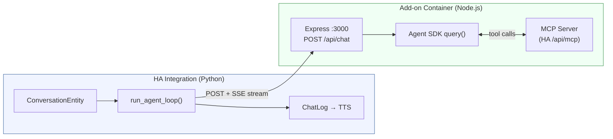

# Claude Conversation Agent for Home Assistant

A custom Home Assistant integration that uses Anthropic's Claude as a conversation agent. The system is split into two components:

- **Node.js Add-on** -- runs in an HA add-on container, wraps the [Claude Agent SDK](https://github.com/anthropics/claude-code), handles MCP connections, tool calling, and streaming responses.
- **Python Integration** -- thin HA conversation plumbing that sends user text to the add-on and streams text deltas to TTS.

Claude controls your smart home exclusively through [Model Context Protocol (MCP)](https://modelcontextprotocol.io/) servers. The add-on auto-connects to HA's built-in MCP server, giving Claude access to all exposed entities and services.

## Features

- **Two-component architecture** -- heavy lifting in a Node.js container, thin Python integration for HA plumbing.
- **Dual authentication** -- API key or Claude Max subscription.
- **Auto MCP** -- add-on auto-connects to HA's MCP server using SUPERVISOR_TOKEN. No manual MCP configuration needed.
- **Streaming responses** -- text deltas are streamed to TTS as they arrive, so the user hears speech before tool calls finish.
- **MCP-only tool access** -- Claude never uses HA's native intent system. All actions go through MCP, keeping the tool surface explicit and auditable.
- **Security** -- built-in Claude Code tools (Bash, file I/O, etc.) are explicitly disallowed. Only MCP tools are permitted.
- **Multi-turn conversations** -- session IDs are persisted per conversation with a 5-minute timeout.
- **Configurable system prompt** -- supports Jinja2 templates for dynamic context.
- **Model selection** -- Claude Sonnet 4.5, Opus 4.6, Haiku 4.5, or custom model IDs.
- **Ingress web UI** -- auth status and Max subscription login from the HA sidebar.

## Architecture



## Prerequisites

- **Home Assistant 2025.7.0** or newer with Supervisor (Home Assistant OS or Supervised install)
- **HACS** (Home Assistant Community Store) installed
- **Anthropic API key** from [console.anthropic.com](https://console.anthropic.com/) (for API key auth mode)

## Installation

### Step 1: Add the add-on repository

1. Go to **Settings > Add-ons > Add-on Store**.
2. Click the three-dot menu in the top right and select **Repositories**.
3. Enter: `https://github.com/nick-pape/claude-ha-conversation-agent`
4. Click **Add**, then find "Claude Agent" in the store and click **Install**.
5. Start the add-on.

### Step 2: Install the integration

1. Open HACS in your Home Assistant instance.
2. Go to **Integrations** and click the three-dot menu.
3. Select **Custom repositories**.
4. Enter: `https://github.com/nick-pape/claude-ha-conversation-agent`
5. Set category to **Integration** and click **Add**.
6. Find "Claude Conversation Agent" in HACS and click **Download**.
7. Restart Home Assistant.

### Step 3: Configure the integration

1. Go to **Settings > Devices & services > Add integration**.
2. Search for "Claude Conversation Agent".
3. The integration should auto-discover the add-on. If not, enter the add-on URL manually.
4. Choose authentication mode:
   - **API Key**: Enter your Anthropic API key.
   - **Max Subscription**: Authenticate via the add-on's ingress UI.

### Step 4: Assign to a voice pipeline

1. Go to **Settings > Voice assistants**.
2. Select a voice pipeline (or create a new one).
3. Set the **Conversation agent** to "Claude Conversation Agent".

## Configuration

### Conversation agent settings

After the integration is created, a default conversation agent is automatically added. To reconfigure it (or add more agents), open the integration and click **Configure**.

**Basic settings:**

| Option | Description | Default |
|--------|-------------|---------|
| System prompt | Instructions for Claude. Supports Jinja2 templates. | A concise voice-assistant prompt. |
| Use recommended settings | When enabled, skips advanced model settings. | Enabled |

**Advanced settings** (when "Use recommended settings" is disabled):

| Option | Description | Default |
|--------|-------------|---------|
| Model | Claude model ID. | `claude-sonnet-4-5` |
| Maximum response tokens | Upper limit on tokens per response. | 1024 |
| Temperature | Controls randomness (0.0 = deterministic, 2.0 = creative). | 1.0 |

### Authentication modes

**API Key** -- your Anthropic API key is stored in HA's encrypted config and sent to the add-on with each chat request. The add-on does not persist the key.

**Max Subscription** -- authenticate via the add-on's ingress UI (click "Claude Agent" in the sidebar). The CLI credentials are persisted in the add-on's data directory and survive container restarts.

## Usage

Once configured, the agent responds to any voice pipeline that uses it:

- **Voice commands** via Wyoming satellites, HA Assist app, or browser.
- **Text input** via the Assist dialog in the HA dashboard.
- **Automations** that call the `conversation.process` service.

### Example interactions

> "Turn off the lights in the living room."

Claude calls the appropriate MCP tool and confirms the action.

> "What's the temperature in the bedroom?"

Claude reads sensor data through MCP and responds conversationally.

> "Set the thermostat to 72 and turn on the porch lights."

Claude handles multiple tool calls in sequence (up to 10 rounds per turn).

## Troubleshooting

### "Cannot connect to Claude Agent add-on"

- Make sure the Claude Agent add-on is installed and running.
- Check the add-on logs for startup errors.
- If using manual URL, verify it's reachable from HA.

### Agent responds but cannot control devices

- The add-on auto-connects to HA's MCP server using SUPERVISOR_TOKEN. Check the add-on logs for MCP connection status.
- Verify that HA's MCP server is enabled (it's built-in and should work by default).

### Slow responses

- The agent streams text to TTS as soon as the first tokens arrive. If there is a delay, it's the initial Claude API call latency.
- Consider using `claude-haiku-4-5` for faster response times.

### Conversation context is lost

- Conversation state expires after 5 minutes of inactivity, matching HA's default session timeout.
- Reloading or reconfiguring the integration clears all conversation state.

## Development

### Repository structure

```
claude-ha-conversation-agent/
  repository.yaml                # HA add-on repository manifest
  claude-agent/                  # Node.js add-on
    config.yaml                  # Add-on metadata
    Dockerfile                   # Alpine + Node.js 20
    build.yaml                   # Multi-arch (amd64, aarch64)
    package.json
    src/
      server.js                  # Express HTTP server + SSE
      agent.js                   # Agent SDK wrapper
      auth.js                    # Dual auth management
      ui/index.html              # Ingress web UI
  custom_components/             # Python integration
    claude_conversation_agent/
      __init__.py                # Health-check add-on, store URL
      config_flow.py             # Hassio discovery + auth + subentries
      conversation.py            # ConversationEntity
      agent.py                   # HTTP+SSE client
      entity.py                  # Base entity
      const.py                   # Constants
      manifest.json
      strings.json
      translations/en.json
  tests/
    conftest.py                  # HA stubs + fixtures
    test_agent.py                # Agent loop tests (mock HTTP+SSE)
```

### Running tests

```bash
pytest tests/ -v
```

Tests mock aiohttp to return fake SSE streams. No add-on or Agent SDK needed.

## License

MIT
