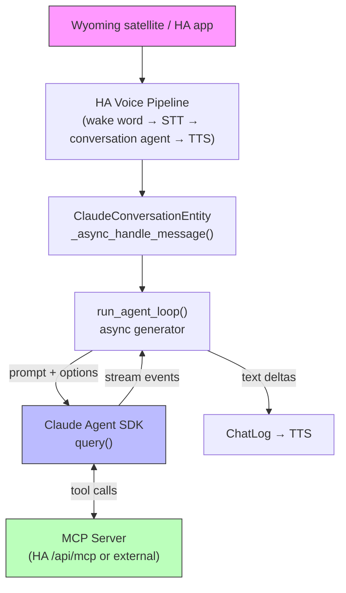

# Claude Conversation Agent for Home Assistant

A custom Home Assistant integration that uses Anthropic's Claude as a conversation agent, powered by the [Claude Agent SDK](https://github.com/anthropics/claude-code-sdk-python). Claude controls your smart home exclusively through [Model Context Protocol (MCP)](https://modelcontextprotocol.io/) servers, giving it access to the same tools and services that Home Assistant exposes via its built-in `/api/mcp` endpoint (or any external MCP server you configure).

Home Assistant owns the voice pipeline (wake word, STT, TTS, Wyoming satellites). This integration slots in as the "brain" -- it receives transcribed text, delegates to the Claude Agent SDK (which handles the full agent loop, MCP connections, tool discovery, and tool execution), and streams text back to TTS in real time.

## Features

- **Claude Agent SDK** -- delegates the entire agent loop (tool calling, MCP connections, multi-turn reasoning) to the official SDK. No manual tool dispatch code.
- **Streaming responses** -- text deltas are yielded to TTS as they arrive from Claude, so the user hears speech before tool calls finish.
- **MCP-only tool access** -- Claude never uses HA's native intent system or built-in service calls. All actions go through MCP, keeping the tool surface explicit and auditable.
- **Multi-turn conversations** -- the SDK's session ID is persisted per conversation with a 5-minute timeout, enabling natural follow-up questions.
- **Configurable system prompt** -- supports Jinja2 templates, so you can inject dynamic context (entity states, time of day, etc.) into the prompt.
- **Model selection** -- choose from Claude Sonnet 4.5, Claude Haiku 4.5, Claude Opus 4.5, or enter a custom model ID.
- **HACS installable** -- no manual file copying required.

## Architecture



Key components:

| File | Role |
|------|------|
| `__init__.py` | Entry setup, creates the `AsyncAnthropic` client, forwards platforms. |
| `config_flow.py` | UI config flow: API key validation, conversation subentry (prompt, model, MCP). |
| `conversation.py` | `ClaudeConversationEntity` -- the HA conversation entity that wires everything together. |
| `agent.py` | `run_agent_loop()` -- async generator that wraps the Claude Agent SDK's `query()`. Extracts streaming text deltas and manages session IDs for conversation continuity. |
| `entity.py` | Base entity class with device info. |
| `const.py` | Domain name, defaults, limits. |

## Prerequisites

- **Home Assistant 2025.7.0** or newer
- **HACS** (Home Assistant Community Store) installed
- **Anthropic API key** from [console.anthropic.com](https://console.anthropic.com/)
- **MCP server** -- Home Assistant's built-in MCP server (available at `/api/mcp`) or any external MCP-compatible server
- A **long-lived access token** for the MCP server (generate one in your HA profile at `/profile/security`)

## Installation

1. Open HACS in your Home Assistant instance.
2. Go to **Integrations** and click the three-dot menu in the top right.
3. Select **Custom repositories**.
4. Enter the repository URL: `https://github.com/nick-pape/claude-ha-conversation-agent`
5. Set the category to **Integration** and click **Add**.
6. Find "Claude Conversation Agent" in the HACS store and click **Download**.
7. Restart Home Assistant.

## Configuration

### Step 1: Add the integration

1. Go to **Settings > Devices & services > Add integration**.
2. Search for "Claude Conversation Agent".
3. Enter your Anthropic API key. The integration validates the key by listing models before saving.

### Step 2: Configure the conversation agent

After the integration is created, a default conversation agent subentry is automatically added. To reconfigure it (or add additional agents), open the integration and click **Configure** on the conversation agent.

**Basic settings:**

| Option | Description | Default |
|--------|-------------|---------|
| System prompt | Instructions for Claude. Supports Jinja2 templates. | A concise voice-assistant prompt. |
| Use recommended settings | When enabled, skips advanced model settings. | Enabled |

**Advanced settings** (when "Use recommended settings" is disabled):

| Option | Description | Default |
|--------|-------------|---------|
| Model | Claude model ID. | `claude-sonnet-4-5` |
| Maximum response tokens | Upper limit on tokens per response. | 1024 |
| Temperature | Controls randomness (0.0 = deterministic, 2.0 = creative). | 1.0 |

**MCP server settings:**

| Option | Description | Example |
|--------|-------------|---------|
| MCP server URL | The URL of your MCP server. | `http://homeassistant.local:8123/api/mcp` |
| MCP server access token | A long-lived access token for authentication. | *(generated in your HA profile)* |

### Step 3: Assign to a voice pipeline

1. Go to **Settings > Voice assistants**.
2. Select a voice pipeline (or create a new one).
3. Set the **Conversation agent** to "Claude Conversation Agent".

## Usage

Once configured, the agent responds to any voice pipeline that uses it:

- **Voice commands** via Wyoming satellites, HA Assist app, or browser.
- **Text input** via the Assist dialog in the HA dashboard (click the chat bubble in the top right).
- **Automations** that call the `conversation.process` service.

### Example interactions

> "Turn off the lights in the living room."

Claude calls the appropriate MCP tool (e.g., `ha__call_service`) and confirms the action.

> "What's the temperature in the bedroom?"

Claude reads sensor data through MCP and responds conversationally.

> "Set the thermostat to 72 and turn on the porch lights."

Claude handles multiple tool calls in sequence (up to 10 rounds per turn).

### System prompt tips

The system prompt supports Jinja2, so you can include dynamic HA data:

```yaml
# Example: inject the current time
You are a helpful home assistant. The current time is {{ now().strftime('%I:%M %p') }}.
Keep responses concise and conversational.
```

## Troubleshooting

### "Failed to connect to MCP server"

- Verify the MCP server URL is reachable from Home Assistant. If HA runs in a container, `localhost` may not resolve -- use `homeassistant.local` or the container's host IP.
- Check that the long-lived access token is valid and has not expired.
- Look for detailed errors in the Home Assistant log (`Settings > System > Logs`) and filter for `claude_conversation_agent`.

### "Authentication failed. Please update your API key."

- Your Anthropic API key is invalid or has been revoked. The integration will prompt you to re-authenticate.

### Agent responds but cannot control devices

- Confirm the MCP server URL and token are configured in the conversation agent settings.
- Check that the MCP server exposes the tools you expect. You can test with: `curl -H "Authorization: Bearer <token>" http://homeassistant.local:8123/api/mcp`
- Review the logs for `Agent SDK initialized. MCP servers:` -- this shows connection status for each configured server.

### Slow responses

- The agent streams text to TTS as soon as the first tokens arrive. If there is a delay, it is likely the initial Claude API call latency.
- Make sure `max_tokens` is not set unnecessarily high -- shorter limits mean faster responses for simple queries.
- Consider using `claude-haiku-4-5` for faster response times at the cost of some capability.

### Conversation context is lost

- Conversation state expires after 5 minutes of inactivity. This is intentional and matches HA's default session timeout.
- Reloading or reconfiguring the integration clears all conversation state.

### MCP connection issues

- The Claude Agent SDK manages MCP connections internally. If the server is unreachable, the agent will still respond but without tool access.
- Check the MCP server's health independently to rule out server-side issues.
- Look for `MCP server 'ha' failed to connect` warnings in the logs.

## Development

### Project structure

```
custom_components/claude_conversation_agent/
  __init__.py           # Integration setup
  config_flow.py        # Config flow UI
  conversation.py       # ConversationEntity
  agent.py              # Agent SDK wrapper (async generator)
  entity.py             # Base entity
  const.py              # Constants and defaults
  manifest.json         # Integration metadata
  strings.json          # UI strings
  translations/en.json  # English translations
```

### Dependencies

From `manifest.json`:

- `anthropic>=0.49.0` -- Anthropic Python SDK (used for API key validation and model listing)
- `claude-agent-sdk>=0.1.38` -- Claude Agent SDK (handles the full agent loop, MCP, and tool calling)

### Key design decisions

1. **Claude Agent SDK.** Instead of implementing a manual agent loop with tool dispatch, the integration delegates to the Claude Agent SDK's `query()` function. The SDK handles MCP connections, tool discovery, tool execution, and multi-turn reasoning internally. This keeps the integration thin and benefits from upstream improvements.

2. **MCP-only tool access.** The integration passes `user_llm_hass_api=None` to `async_provide_llm_data`, which disables HA's native LLM tool system. All tool calls go through MCP via the Agent SDK, giving you full control over what Claude can do.

3. **Streaming via async generator.** `run_agent_loop()` wraps the SDK's `query()` async iterator, extracting `StreamEvent` messages with `include_partial_messages=True`. It yields `{"role": "assistant"}` and `{"content": "..."}` dicts that the conversation entity pipes into HA's `ChatLog.async_add_delta_content_stream()`.

4. **Session-based continuity.** Conversation state stores the SDK session ID (not raw message history). On follow-up turns, the session ID is passed via `resume` to the SDK, which restores full conversation context internally.

### Running locally

For development, clone the repo into your HA custom_components directory:

```bash
cd /path/to/ha-config/custom_components
git clone https://github.com/nick-pape/claude-ha-conversation-agent.git claude_conversation_agent
```

Or symlink:

```bash
ln -s /path/to/claude-ha-conversation-agent/custom_components/claude_conversation_agent \
      /path/to/ha-config/custom_components/claude_conversation_agent
```

Then restart Home Assistant. Changes to Python files require a restart or integration reload.

## License

MIT
